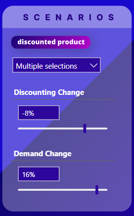
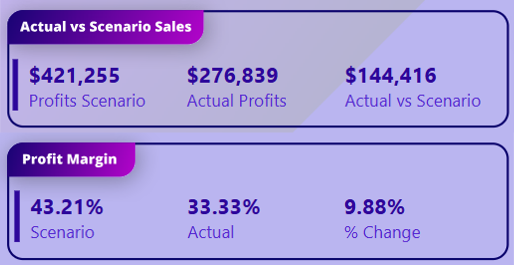
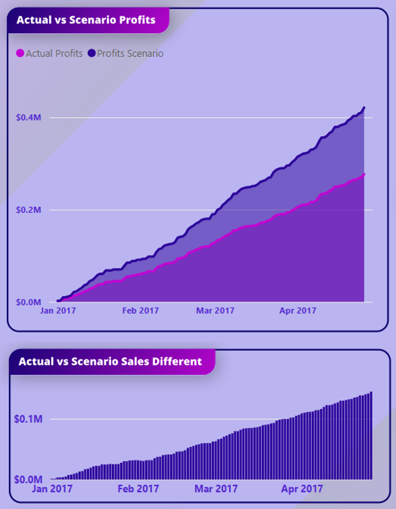
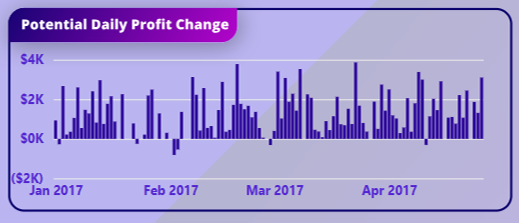

# InnovateMart Product Discount Strategy Simulator: A Power BI Case Study

<p align="center">
  <a href="https://tinyurl.com/2cw92kbf" target="_blank">
    
  </a>
</p>

This repository contains a "What-If" scenario analysis tool built in Power BI for "InnovateMart," a fictional national retail chain. The project moves beyond historical reporting to provide a forward-looking decision support system. It empowers business leaders to simulate the financial impact of potential product discount strategies *before* they are launched, minimizing risk and maximizing profitability.


## Table of Contents
- [1. Case Study Overview](#1-case-study-overview)
  - [The Business Problem: The High Risk of Discounting](#the-business-problem-the-high-risk-of-discounting)
  - [The Solution: A Financial Flight Simulator](#the-solution-a-financial-flight-simulator)
  - [Key Features & Business Value](#key-features--business-value)
  - [Tech Stack](#tech-stack)
- [2. The Dashboard Walkthrough](#2-the-dashboard-walkthrough)
- [3. Repository Structure](#3-repository-structure)
- [4. How to Explore This Project](#4-how-to-explore-this-project)

---

## 1. Case Study Overview

### The Business Problem: The High Risk of Discounting
InnovateMart frequently uses promotions to drive sales, but the process has historically been based on intuition rather than data. Key decisions about which products to discount and by how much were made without a clear understanding of the potential impact on overall profitability. This created significant business risks:
*   **Profit Erosion:** A discount could increase sales volume but decrease the bottom line if the margin loss wasn't offset by sufficient demand.
*   **Wasted Marketing Spend:** Promotions were launched without knowing the optimal discount level, leading to potential underperformance.
*   **Inability to Forecast:** The finance and sales teams could not accurately predict the outcome of their promotional campaigns.

### The Solution: A Financial Flight Simulator
This Power BI dashboard was developed to function as a "flight simulator" for promotional planning. It allows brand managers and sales directors to model different scenarios in a risk-free environment. By adjusting interactive sliders, they can simulate the effects of price changes and corresponding shifts in customer demand, receiving immediate feedback on key financial metrics.

### Key Features & Business Value
*   **Interactive Scenario Builder:** Users can select any combination of products, apply a discount from 0-30%, and model an expected change in demand from -10% to +19%.
*   **Instant Financial Feedback:** The dashboard instantly recalculates `Scenario Profits`, `Profit Margin`, and the total financial uplift or loss versus the baseline forecast.
*   **Cumulative Impact Analysis:** Visuals like the "Actual vs Scenario Profits" chart show the accumulating impact of a promotional strategy over time, providing a much richer view than a single summary number.
*   **Reduced Decision Risk:** Empowers InnovateMart to test hypotheses, identify the most profitable discount levels, and avoid costly mistakes.

### Tech Stack
*   **Analysis & Visualization:** Power BI Desktop & Power BI Service
*   **Modeling & Calculations:** DAX (What-If Parameters & Scenario Logic)
*   **Data Transformation (ETL):** Power Query

---

## 2. The Analytical Approach: A Dashboard Deep Dive

The dashboard is designed as an interactive decision support tool, guiding a user through a logical analytical workflow: from defining a hypothetical scenario to understanding its high-level impact and analyzing its performance over time.

### 1. The Control Panel: Building the "What-If" Scenario

The journey begins on the right-hand panel, where a manager can build a complete promotional strategy from scratch.

<p align="center">  </p>

*   **Product & Time Filters:** The user first defines the scope by selecting the product(s) for the promotion, the time period, and the geographic region (state).
*   **The Core Levers:** The user then adjusts two key inputs:
    1.  **Discounting Change:** A slider to set the price reduction.
    2.  **Demand Change:** A slider to model the expected increase in sales volume resulting from the discount. This is a critical assumption that can be tested at different levels.

### 2. The Bottom Line: Instant Financial Impact

As soon as the scenario is defined, the KPI cards at the top provide an immediate, high-level summary, answering the most critical question: **"Is this proposed promotion financially viable?"**

<p align="center">  </p>

*   **Profit & Sales Impact:** This card shows the total projected `Profits Scenario` compared to the `Actual Profits` forecast. The "Actual vs Scenario" difference is the ultimate bottom line—the total estimated dollar gain or loss from running the campaign.
*   **Profitability Health:** The `Profit Margin` card is crucial. It shows whether the promotion enhances or erodes profitability. A successful scenario is one that not only increases total profit but also maintains a healthy margin.

### 3. Trend & Volatility Analysis: Understanding Performance Over Time

The main charts on the dashboard allow a manager to move beyond the summary numbers and analyze the *character* of the scenario's performance over the selected period.

<p align="center">  </p>

*   **Cumulative Profit Trajectory:** The `Actual vs Scenario Profits` area chart is arguably the most important visual. It shows how the profit from the scenario (dark purple) accumulates over time compared to the baseline forecast (light purple). This allows a manager to see *when* the strategy starts to pay off and if its lead is growing or shrinking.
*   **Net Scenario Contribution:** The `Actual vs Scenario Sales Different` chart isolates the cumulative *net difference* in sales, showing a clear upward trend of the value being added by the promotion day after day.
*   **Daily Risk & Volatility:** The `Potential Daily Profit Change` chart provides the most granular view, answering the question: **"Is this a steady and reliable promotion?"** It shows the daily profit variance between the scenario and the forecast. Consistent positive bars indicate a stable, low-risk strategy. Wild swings between positive and negative bars signal a volatile, higher-risk promotion.

<p align="center">  </p>

This comprehensive, multi-layered analysis transforms the dashboard from a report into a true strategic simulator.

**For a complete breakdown of the forecasting methodology and the entire DAX engine powering this simulator, please see the detailed documentation in the `docs/` folder.**

---

## 3. Repository Structure
```
.
├── assets/
│   ├── scenario_demo.gif
│   ├── dashboard_overview.png
│   └── data_model.png
├── docs/
│   ├── 01_Business_Context.md
│   ├── 02_Analytical_Approach.md
│   └── 03_DAX_Implementation.md
├── .gitignore
└── README.md
```

---

## 4. How to Explore This Project
1.  **Interact with the Live Simulator:**
    *   Click the "Live Simulator" badge at the top of this page or go directly to: [Dashboard Demo](https://tinyurl.com/2cw92kbf)
2.  **Review the Documentation:**
    *   For a deeper understanding of the business logic and technical implementation, review the detailed markdown files in the `docs/` folder.


