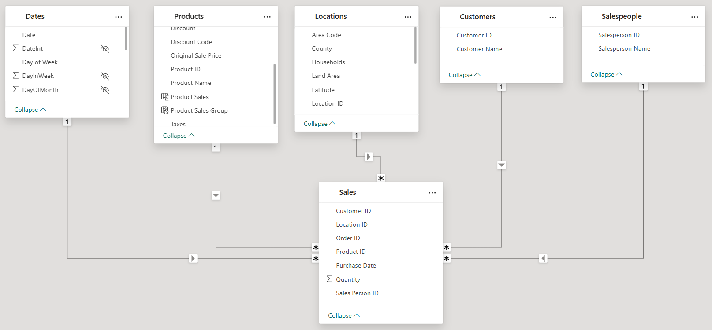

# 3. DAX Implementation: The Simulation Engine

This document details the complete technical foundation of the InnovateMart Discount Strategy Simulator, including the data model structure and an exhaustive dictionary of all DAX calculations that power the tool.

## Data Model

The project is built on a standard Star Schema, centered around a `Sales` fact table. This design is optimized for the performance and flexibility required for complex scenario analysis.



### Table Descriptions

| Table       | Type      | Description                                                                                             |
|-------------|-----------|---------------------------------------------------------------------------------------------------------|
| **Sales**   | Fact      | Contains the granular transactional data. Each row represents a line item with a quantity and IDs.         |
| **Dates**   | Dimension | A standard calendar table providing time-based attributes for all time-intelligence calculations.       |
| **Products**| Dimension | Contains a unique list of all products, including their names, costs, and prices.                     |
| **Locations** | Dimension | Contains geographic data about where sales occurred, such as state and county.                       |
| **Customers** | Dimension | A unique list of all customers who made purchases.                                                      |
| **Salespeople**| Dimension | A unique list of all salespeople associated with transactions.                                          |

---

## The Complete DAX Dictionary

The following sections detail all DAX logic, structured by function, from foundational calculations to the final outputs.

### Part 1: Core Aggregation Measures

These are the fundamental building blocks of the entire model, calculating basic business metrics from the raw data.

**`Total Sales`**
*   **Purpose:** Calculates the total revenue based on the quantity sold and the current price of each product.
*   **DAX Code:**
    ```dax
    Total Sales =
    SUMX(
        Sales,
        Sales[Quantity] * RELATED(Products[Current Price])
    )
    ```

**`Total Costs`**
*   **Purpose:** Calculates the total cost of goods sold based on the quantity sold and the cost of each product.
*   **DAX Code:**
    ```dax
    Total Costs =
    SUMX(
        Sales,
        Sales[Quantity] * RELATED(Products[Cost])
    )
    ```

**`Total Profits`**
*   **Purpose:** Calculates the total profit by subtracting costs from sales.
*   **DAX Code:**
    ```dax
    Total Profits = [Total Sales] - [Total Costs]
    ```

---

### Part 2: User Input Parameters

These measures create and capture the values from the interactive sliders.

**`Discounting Change` & `Demand Chang` (Calculated Tables)**
*   **Purpose:** These `GENERATESERIES` functions create the underlying single-column tables of numbers that feed the slicers, defining the range of user inputs.
*   **DAX Code:**
    ```dax
    Discounting Change = GENERATESERIES(-0.3, 0, 0.01)
    Demand Chang = GENERATESERIES(-0.1, 0.2, 0.01)
    ```

**`Discounting Change Value` & `Demand Chang Value` (Measures)**
*   **Purpose:** These measures use `SELECTEDVALUE` to capture the single number the user has selected on each slider, making it available for other calculations.
*   **DAX Code:**
    ```dax
    Discounting Change Value = SELECTEDVALUE('Discounting Change'[Discounting Change], 0)
    Demand Chang Value = SELECTEDVALUE('Demand Chang'[Demand Chang], 0)
    ```

---

### Part 3: Baseline Forecast Measures

These measures calculate the "Actuals" for the dashboard, which are a forecast based on the previous year's data.

**`ALL 2017 Forecast Sales / Profits / Costs`**
*   **Purpose:** To create a stable, unchanging baseline forecast for the entire business, regardless of user selections.
*   **Pattern:** They use `CALCULATE([Measure], DATEADD(Dates[Date], -1, YEAR))` to pull last year's data. The `ALL(Products)` filter modifier is crucial, as it ensures the calculation is always for the *total* product catalog.
*   **DAX Code:**
    ```dax
    ALL 2017 Forecast Sales =
    CALCULATE(
        CALCULATE(
            [Total Sales],
            DATEADD(Dates[Date], -1, YEAR)
        ),
        ALL(Products)
    )

    ALL 2017 Forecast Profits =
    CALCULATE(
        CALCULATE(
            [Total Profits],
            DATEADD(Dates[Date], -1, YEAR)
        ),
        ALL(Products)
    )

    ALL 2017 Forecast Costs =
    CALCULATE(
        CALCULATE(
            [Total Costs],
            DATEADD(Dates[Date], -1, YEAR)
        ),
        ALL(Products)
    )
    ```

---

### Part 4: The Scenario Calculation Engine

This is the core logic that computes the financial outcome of the user-defined hypothetical scenario.

**`2017 Discounted Sales`**
*   **Purpose:** Calculates the new sales value for *only the products selected* in the slicer, applying both the demand increase and the price discount to last year's data.
*   **DAX Code:**
    ```dax
    2017 Discounted Sales =
    CALCULATE(
        SUMX(Sales, (Sales[Quantity] * (1 + [Demand Chang Value])) * (RELATED(Products[Cost]) * (1 + [Discounting Change Value]))),
        DATEADD(Dates[Date], -1, YEAR)
    )
    ```

**`2017 Non-Discounted Sales`**
*   **Purpose:** Calculates the sales for all products *not* included in the promotion, ensuring they are still part of the total scenario calculation.
*   **DAX Code:**
    ```dax
    2017 Non-Discounted Sales =
    CALCULATE(
        CALCULATE(
            SUMX(Sales, (Sales[Quantity] * (1 + [Demand Chang Value])) * RELATED(Products[Current Price])),
            EXCEPT(ALL(Products[Product Name]), VALUES(Products[Product Name]))
        ),
        DATEADD(Dates[Date], -1, YEAR)
    )
    ```

**`2017 Scenario Sales` & `2017 Profits Scenario`**
*   **Purpose:** Combines the discounted and non-discounted products to get a total scenario performance and then calculates the final profit.
*   **DAX Code:**
    ```dax
    2017 Scenario Sales = [2017 Discounted Sales] + [2017 Non-Discounted Sales]
    2017 Profits Scenario = [2017 Scenario Sales] - [ALL 2017 Forecast Costs]
    ```

---

### Part 5: Final Comparison & Time-Intelligence Measures

These measures calculate the differences, margins, and cumulative trends that are displayed in the visuals.

**`Profit Scenario vs Forecast Diff`**
*   **Purpose:** Calculates the absolute dollar difference between the scenario profit and the baseline forecast profit.
*   **DAX Code:**
    ```dax
    Profit Scenario vs Forecast Diff = [2017 Profits Scenario] - [ALL 2017 Forecast Profits]
    ```

**`Profit Margin` & `Profit Margin Scenario`**
*   **Purpose:** Calculates the profit margin for both the baseline forecast and the new scenario.
*   **DAX Code:**
    ```dax
    Profit Margin =
    DIVIDE(
        [ALL 2017 Forecast Profits],
        [ALL 2017 Forecast Sales],
        0
    )

    Profit Margin Scenario =
    DIVIDE(
        [2017 Profits Scenario],
        [2017 Scenario Sales]
    )
    ```

**`Profit Margin Diff`**
*   **Purpose:** Calculates the absolute percentage point difference between the two profit margins.
*   **DAX Code:**
    ```dax
    Profit Margin Diff = [Profit Margin Scenario] - [Profit Margin]
    ```

**`Cumulative 2017 Profits` & `Cumulative 2017 Profits Scenario`**
*   **Purpose:** Creates the running total of profits for both the baseline and the scenario, feeding the main area chart.
*   **DAX Code:**
    ```dax
    Cumulative 2017 Profits =
    CALCULATE(
        [ALL 2017 Forecast Profits],
        FILTER(
            ALLSELECTED(Dates),
            Dates[Date] <= MAX(Dates[Date])
        )
    )

    Cumulative 2017 Profits Scenario =
    CALCULATE(
        [2017 Profits Scenario],
        FILTER(
            ALLSELECTED(Dates),
            Dates[Date] <= MAX(Dates[Date])
        )
    )
    ```

**`Cumulative Profits Scenario - Forecast Diff`**
*   **Purpose:** Calculates the running total of the *difference* between scenario and forecast profit, feeding the "Actual vs Scenario Sales Different" chart.
*   **DAX Code:**
    ```dax
    Cumulative Profits Scenario - Forecast Diff =
    CALCULATE(
        [Cumulative 2017 Profits Scenario] - [Cumulative 2017 Profits],
        FILTER(
            ALLSELECTED(Dates),
            Dates[Date] <= MAX(Dates[Date])
        )
    )
    ```